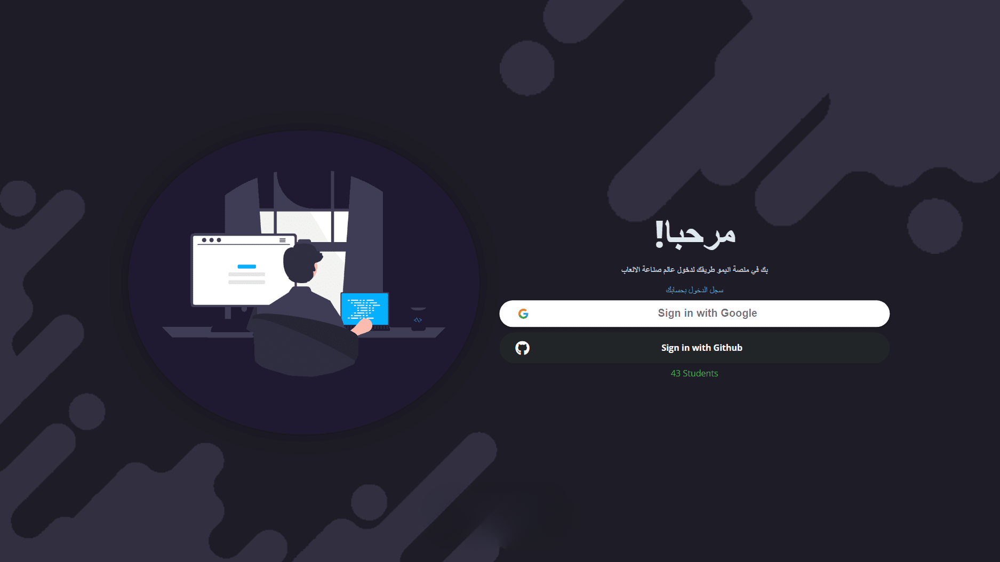
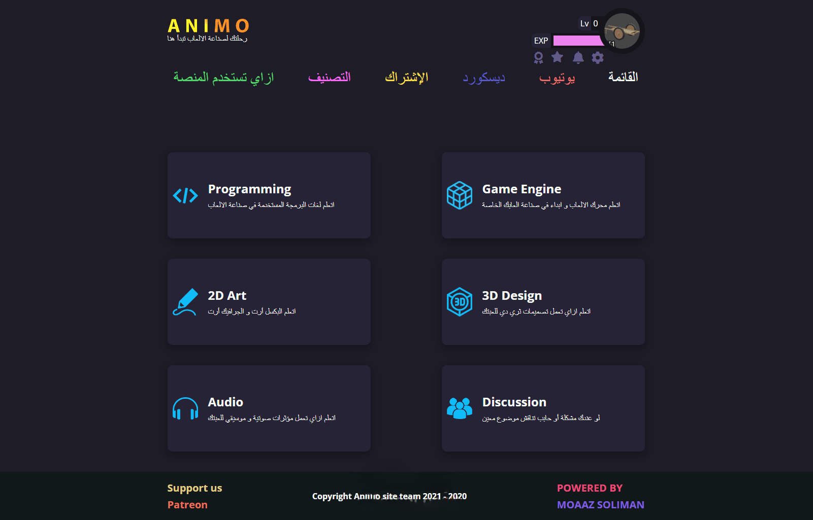
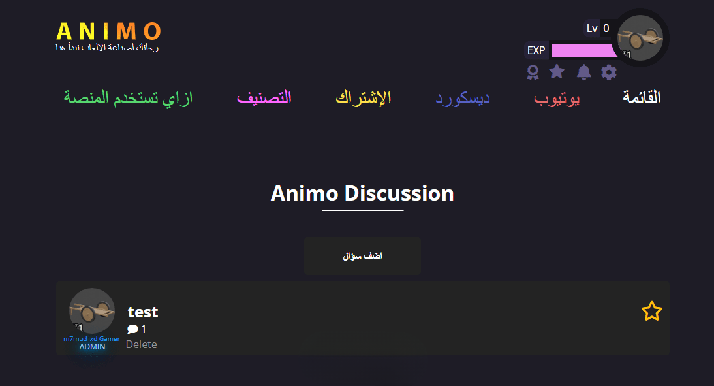
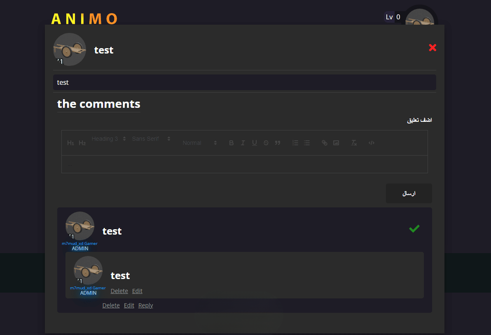

# AnimoGameDev

AnimoGameDev is a dynamic platform for game developers to collaborate, learn, and grow. It offers interactive features such as XP leveling, medals, rankings, blogs, and real-time notifications, fostering an engaging community experience.

---

## 🌟 Features
- **Google Login**: Seamless authentication using Google OAuth.
- **XP Leveling System**: Reward users for their activity and contributions.
- **Medals and Rankings**: Gamified features to recognize and rank users.
- **Blogs**: Share knowledge and tutorials with the community.
- **Real-Time Notifications**: Keep users updated with platform activities.
- **Responsive Design**: Optimized for a wide range of devices.

---

## 🛠️ Technologies Used
- **Frontend**: HTML, CSS, JavaScript, React.js
- **Backend**: Firebase (Authentication and Database)

---

## 🚀 Installation and Setup

### Prerequisites
- Node.js and npm installed

### Steps
1. Clone the repository:
   ```bash
   git clone https://github.com/mmud/animogamedev-system.git
   ```

2. Navigate to the project directory:
   ```bash
   cd animogamedev-system
   ```

3. Install dependencies:
   ```bash
   npm install
   ```
4. Start the development server:
   ```bash
   npm start
   ```

5. Access the platform in your browser at `http://localhost:3000`.

---

## 🖥️ Screenshots










---

## 📈 Achievements
- Attracted a growing community of game developers with interactive features.
- Enhanced user engagement through gamification and real-time updates.

---

## 📄 License
This project is licensed under the MIT License. See the [LICENSE](LICENSE) file for details.
